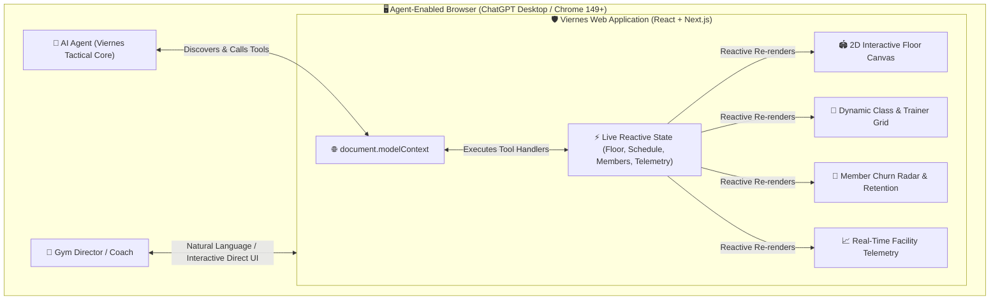

# 🛡️ VIERNES — The Autonomous Gym ERP & Visual Floor Commander

> **Viernes** (F.R.I.D.A.Y.) is an agent-native Gym Operations ERP and Visual Floor Commander built for modern athletic facilities, boutique fitness studios, and high-performance training centers.  
> Powered by the **Web Model Context Protocol (WebMCP)**, Viernes transforms traditional, fragmented gym management software into an interactive, real-time workspace where gym directors and AI agents collaborate seamlessly across interactive 2D floor plans, class schedules, member retention radars, and live telemetry.

[](https://github.com/webmachinelearning/webmcp)
[](https://opensource.org/licenses/MIT)
[](https://developer.chrome.com/docs/ai/webmcp)
[](https://nextjs.org/)

---

## ⚡ Live Links & Resources
* 🌐 **Live Application**: *`https://viernes-gym-erp.vercel.app`*
* 🎥 **Demonstration Video**: *`https://youtu.be/your-demo-video`*
* 🏆 **Hackathon**: Built for the **OpenAI WebMCP Challenge**

---

## 💡 The Problem & The WebMCP Paradigm Shift

### ❌ Legacy Gym Software (The Old Way)
Traditional gym management platforms are clunky, multi-tab database forms. Gym owners, head coaches, and operations directors waste hours every week:
- Manually clicking through disconnected menus to reschedule classes when instructors fall ill.
- Guessing which squat rack or cable pulley has a maintenance ticket.
- Reacting too late after premium members have already dropped attendance and churned.
- Relying on external AI chatbots that cannot touch or manipulate the actual application state.

### ✨ The Viernes Experience (The WebMCP Way)
With **WebMCP (`document.modelContext.registerTool`)**, Viernes gives the browser's AI agent direct, typed, programmatic control over the live in-memory application state and visual canvas.

A gym manager simply speaks or types in natural language:
> *"Viernes, Bench Press #3 has a frayed cable. Mark it down for maintenance, highlight it red on the tactical floor plan, and move Coach Marcus's 5:30 PM Hypertrophy session to Zone C."*

The AI agent invokes `update_gym_floor_equipment` and `manage_class_schedule` via WebMCP, instantly updating the 2D floor canvas with a pulsing caution indicator and adjusting the calendar in real time.



---

## 🎨 Visual Identity: Stark Obsidian & Iron Pulse Orange
Inspired by Tony Stark’s tactical AI assistant **F.R.I.D.A.Y.**, Viernes features an ultra-premium dark obsidian interface paired with high-energy neon orange accents:
* **Backgrounds**: Deep Carbon Slate (`#0B0F17`, `#111726`, `#1B2236`)
* **Primary Accent**: Electric Iron Pulse Orange (`#FF5500`, `#FF7700`)
* **Highlights & Status**: Telemetry Cyan (`#00E5FF`), Alert Crimson (`#FF3366`), Success Emerald (`#00E676`), Amber Gold (`#FFAA00`)

---

## 🏛️ Core Features & Modules

### 1. 🏟️ Tactical Visual Floor Commander
* Interactive 2D vector blueprint of a 15,000 sq ft athletic training center across 5 operational zones (**Zone A**: Squat Racks, **Zone B**: Free Weights, **Zone C**: Turf Arena, **Zone D**: Cardio Velocity Deck, **Zone E**: Recovery Lounge).
* Real-time machine operational status badges, wear-and-tear duty cycles, and AI agent attention pulse animations.
* Interactive popover for equipment maintenance logs and drag-and-drop or agent-driven asset relocation.

### 2. 📅 Dynamic Class Timeline & Trainer Roster
* High-density interactive weekly calendar with live capacity indicators (`18/20 booked`).
* Instant conflict detection for trainer double-booking or room capacity violations.
* Dynamic one-click trainer substitution and room reassignment.

### 3. 👥 Member Churn Radar & Retention Center
* Algorithmic churn risk scoring (`0–100%`) calculated from visit frequency decay and activity patterns.
* Cohort filters: **VIP Loyal**, **Steady Grinders**, and **High Churn Alert (>70%)**.
* Automated retention campaign drawer with pre-generated personalized SMS/email vouchers (smoothie bar freebies, PT sessions, membership discounts).

### 4. 📈 Facility Telemetry & Revenue Scenario Sandbox
* Live facility metrics: Monthly Recurring Revenue (MRR), Active Headcount Occupancy, Coach Utilization Rate, and Equipment Uptime %.
* Dynamic sensitivity modeling showing projected financial impacts of price adjustments, class additions, and churn reduction.

### 5. 🎙️ Floating Viernes AI Copilot HUD
* Built-in bottom command bar with an animated audio-wave visualizer and one-click demo scenario presets.
* Real-time execution logger displaying live JSON payloads, parameters, and tool latency.

---

## 🛠️ WebMCP Tool Catalog

Viernes registers a comprehensive suite of typed tools directly on `document.modelContext`:

| Tool Name | Description | Key Parameters |
| :--- | :--- | :--- |
| `update_gym_floor_equipment` | Updates machine operational status, maintenance notes, or moves assets on the 2D floor canvas. | `equipmentId`, `status`, `notes`, `zone` |
| `manage_class_schedule` | Adds, reschedules, cancels, or reassigns trainers to classes with room capacity validation. | `action`, `classId`, `trainerId`, `timeSlot`, `room` |
| `query_member_cohorts` | Filters active CRM database by churn risk score, inactive days, and membership tier. | `riskLevel`, `inactiveDaysMin`, `tier` |
| `launch_retention_campaign` | Dispatches personalized re-engagement offers and queues SMS/email blasts. | `memberIds`, `offerType`, `discountPercent` |
| `simulate_revenue_forecast` | Runs financial scenario models on price changes, class capacity, and retention gains. | `priceAdjustment`, `capacityDelta`, `churnReductionPct` |
| `get_facility_telemetry` | Retrieves real-time occupancy heatmaps, equipment duty cycles, and peak hour trends. | `zoneId`, `timeRange`, `metricType` |

---

## 🚀 Quick Start & Installation

### Prerequisites
* **Node.js**: v18.0 or higher
* **Package Manager**: `npm`, `pnpm`, or `bun`

### Local Setup
```bash
# 1. Clone the repository
git clone https://github.com/your-username/webmcp-challenge.git
cd webmcp-challenge

# 2. Install dependencies
npm install

# 3. Start the local development server
npm run dev
```

Open [http://localhost:3000](http://localhost:3000) in your browser.

---

## 🧪 Testing with WebMCP-Enabled Browsers

### 1. Google Chrome 149+ (Experimental Flag)
1. Open Google Chrome (v149 or later).
2. Navigate to `chrome://flags/#enable-webmcp-testing` $\rightarrow$ set to **Enabled** $\rightarrow$ click **Relaunch**.
3. Open your Viernes URL.
4. Press `F12` to open DevTools $\rightarrow$ navigate to the **Application** tab $\rightarrow$ select **WebMCP** to inspect and test all 6 registered tools.

### 2. ChatGPT Desktop App
1. Open the **ChatGPT Desktop App**.
2. Navigate to your deployed Viernes URL inside the in-app browser.
3. Chat naturally with ChatGPT: *"Check which members are at high risk of churning and reschedule Coach Marcus's Thursday 6 PM class to Studio B."*
4. Watch the agent discover and execute the tools directly on your active page.

### 3. Built-In Viernes HUD Simulator
* You can also test all multi-tool agent workflows directly inside any standard browser using the floating **Viernes HUD** at the bottom of the interface!

---

## 🔒 Security & Trust Boundaries
* **Strict Runtime Validation**: All tool arguments are defensively validated with Zod against their registered JSON schemas.
* **Human-in-the-Loop Safeguards**: Sensitive operations (e.g. launching financial discounts or deleting schedules) trigger visual confirmation states before final execution.
* **Prompt Injection Resilience**: In-page state mutations use sanitized handlers with zero raw `eval` or unsanitized HTML injections.

---

## 📄 License
This project is open-source software licensed under the **[MIT License](LICENSE)**.
